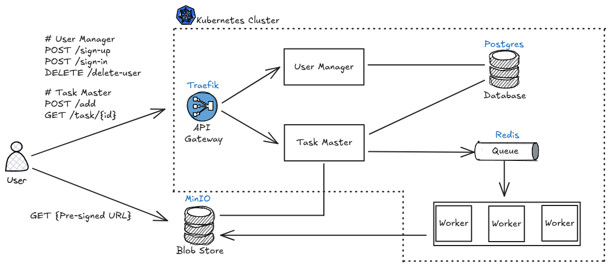

# Fractal Animation Server

!!! note ""

    :simple-github: [Click here for GitHub repository](https://github.com/faerlin-developer/fractal-animation-server)

__Fractal Animation Server__ is a service that generates and serves fractal visualizations, such as animations of Julia Sets, on demand. The application features a modern service-oriented design, exposing a simple RESTful API for users to request Julia set animations in MP4 format. The high-level system design of the service is shown below:

### Components

- :material-traffic-light: __Traefik__: API Gateway that routes traffic to the right service in the cluster.
- :fontawesome-solid-user: __User Manager__: Authentication and access control microservice.
- :simple-task: __Task Master__: Task scheduler microservice.
- :simple-postgresql: __PostgreSQL__: Stores user and task metadata.
- :simple-redis: __Redis__: Utilized as a queue distributing tasks to worker applications.
- :fontawesome-solid-user-pen: __Worker__: Generates fractal animations in MP4 format and stores them in object storage.
- :material-database: __MinIO__: S3-compatible object storage for fractal animations generated by worker applications.

### Example Output

When a user submits a task starting with the Julia Set defined at the complex point (-0.80,-0.18), the service produces the following 5-second video:

  <video width="500" controls>
    <source src="../assets/projects/sample.mp4" type="video/mp4">
  </video>

### Built With

-   
-  
-  
- [Kind](https://kind.sigs.k8s.io/)
- [Traefik](https://traefik.io/traefik)
- [MinIO](https://www.min.io/)
