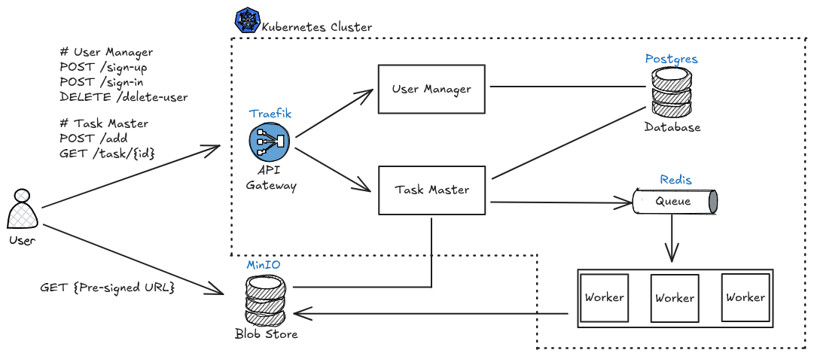

# Fractal Animation Server

!!! note ""

    :simple-github: [Click here for GitHub repository](https://github.com/faerlin-developer/fractal-animation-server)

__Fractal Animation Server__ is a service that generates and serves fractal visualizations, such as animations of Julia Sets, on demand. The application features a modern service-oriented design, exposing a simple RESTful API for users to request Julia set animations in MP4 format. The high-level system design of the service is shown below:

### Components

- :material-traffic-light: __Traefik__: API Gateway that routes traffic to the right service in the cluster.
- :fontawesome-solid-user: __User Manager__: Authentication and access control microservice.
- :simple-task: __Task Master__: Task scheduler microservice.
- :simple-postgresql: __PostgreSQL__: Stores user and task metadata.
- :simple-redis: __Redis__: Utilized as a queue distributing tasks to worker applications.
- :fontawesome-solid-user-pen: __Worker__: Generates fractal animations in MP4 format and stores them in object storage.
- :material-database: __MinIO__: S3-compatible object storage for fractal animations generated by worker applications.

### Example Output

When a user submits a task starting with the Julia Set defined at the complex point (-0.80,-0.18), the service produces the following 5-second video:

  <video width="500" controls>
    <source src="../assets/fractal-animation-server/sample.mp4" type="video/mp4">
  </video>

### Key Features

__API-driven__: Users can request animated fractals via RESTful endpoints. At present, the only supported fractal is the
Julia set. The resulting animation is returned in MP4 format, showing how the Julia set evolves as parameters vary.

__Microservice Architecture__: The system is built as a set of Python-based microservices running inside a `Kubernetes`
cluster with `Traefik` as the ingress controller. User requests are received via REST endpoints, queued in a `Redis`
queue for processing, and handled by worker services that generate Julia set animations. User and task metadata are
persisted in `Postgres`, while the rendered MP4 files are stored in `MinIO` (object storage). Users can retrieve their
completed fractal animations directly from the object storage via pre-signed URLs.

__Authentication__: Users create accounts and are authenticated securely. Upon login, a JSON Web Token (JWT) is issued,
which the client includes in subsequent requests.

__Extensible architecture__: Easily extendable with new fractal types (e.g. Burning Ship, Newton fractals).

### Use Cases

- __Educational Material__: If you’re interested in learning how to build the backend of a microservice architecture on
  Kubernetes, take it apart, explore it, and study how it works from the inside.
- __Creative art__: Generate unique Julia set animations defined at different points of the complex plane.

### Built With

* [![Python][Python]][Python-url] [![FastAPI][FastAPI]][FastAPI-url] [![SQLAlchemy][SQLAlchemy]][SQLAlchemy-url]
* [![Docker][Docker]][Docker-url] [![Kubernetes][Kubernetes]][Kubernetes-url]
* [![Postgres][Postgres]][Postgres-url] [![Redis][Redis]][Redis-url]
* [Kind][Kind-url] (local Kubernetes deployment)
* [Traefik][Traefik-url] (ingress controller)
* [MinIO][MinIO-url] (open source object storage)

<!-- MARKDOWN LINKS & IMAGES -->

[Kubernetes]: https://img.shields.io/badge/kubernetes-326CE5?&style=plastic&logo=kubernetes&logoColor=white
[Kubernetes-url]: https://kubernetes.io/
[Python]: https://img.shields.io/badge/python-3670A0?style=for-the-badge&logo=python&logoColor=ffdd54
[Python-url]: https://www.python.org/
[Redis]: https://img.shields.io/badge/Redis-DC382D?style=for-the-badge&logo=redis&logoColor=white
[Redis-url]: https://redis.io/
[Postgres]: https://img.shields.io/badge/PostgreSQL-316192?logo=postgresql&logoColor=white
[Postgres-url]: https://www.postgresql.org/
[Docker]: https://img.shields.io/badge/docker-257bd6?style=for-the-badge&logo=docker&logoColor=white
[Docker-url]: https://www.docker.com/
[FastAPI]: https://img.shields.io/badge/FastAPI-005571?style=for-the-badge&logo=fastapi
[FastAPI-url]: https://fastapi.tiangolo.com/
[SQLAlchemy]: https://img.shields.io/badge/SQLAlchemy-306998?logo=python&logoColor=white
[SQLAlchemy-url]: https://www.sqlalchemy.org/
[Traefik-url]: https://traefik.io/traefik
[MinIO-url]: https://www.min.io/
[Kind-url]: https://kind.sigs.k8s.io/
