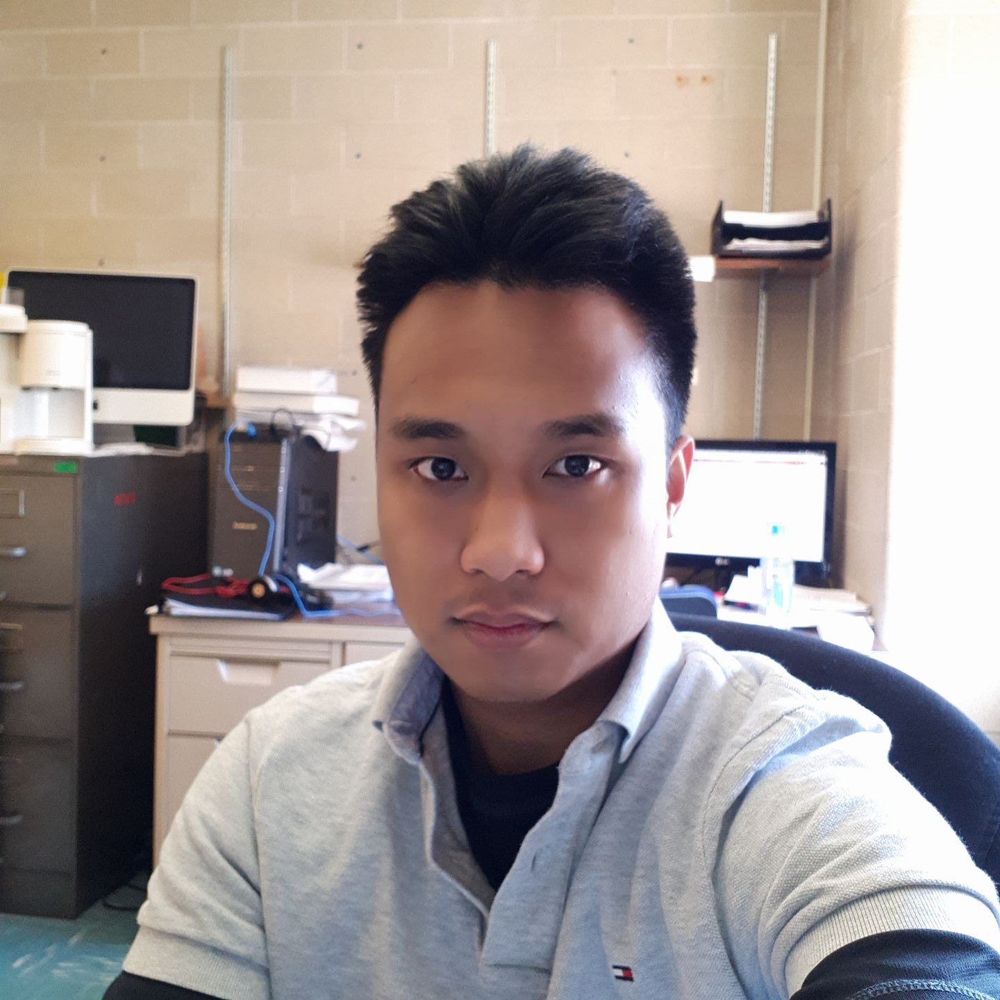

# About

{: style="height:150px;width:150px" align=left}

Hello World! I'm Faerlin. Here, you'll find projects I've worked on both for professional growth and personal curiosity. With experience in Python, Go, C++, Java, and modern web development technologies, I focus on writing high-performance and maintainable code. Take a look around, and feel free to connect.

### Projects

- [__Fractal Animation Server__](fractal-animation-server.md): Generates fractal animations on demand featuring a microservice architecture in a Kubernetes cluster. (Python, FastAPI, Traefik, PostgreSQL, MinIO, Docker, and Kubernetes)
- [__Kanban Board with React__](kanban-board-react.md): React application that lets users create tasks, organizing them into four lanes: _To Do_, _In Progress_, _Review_ and _Completed_. Users can move tasks forward or backward between lanes. (JavaScript, React, Vite, TailwindCSS)
- [__Path Finding Algorithms__](path-finding-algorithms.md): Web application visualizing the traversal of graph search algorithms. (Python, Plotly Dash).
- [__N-Body Simulation__](n-body.md): Simulates the trajectories of particles in an N-body system. Application is configurable to run parallel MPI processes and to utilize a quadtree for better frame rate.  (C++, MPI, SFML). 