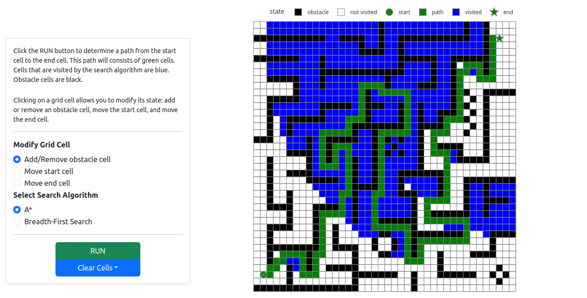

# Path Finding Algorithms

!!! note ""

    :simple-github: [Click here for GitHub repository](https://github.com/faerlin-developer/path-finding-algorithms)

This web application demonstrates the paths and visited nodes of two graph search algorithms: __breadth-first search__ and __A*__, with an architecture easily extendable to include additional algorithms such as __depth-first search__. The grid starts with obstacles arranged in a maze, and users can interactively add or remove obstacles by clicking on cells. The start and end positions can also be repositioned.

### Built With

* [![Python][Python]][Python-url]
* [![Plotly][Plotly]][Plotly-url]

[Python]: https://img.shields.io/badge/python-3670A0?style=for-the-badge&logo=python&logoColor=ffdd54
[Python-url]: https://www.python.org/
[Plotly]: https://img.shields.io/badge/-Plotly-3F4F75?style=flat&logo=plotly&logoColor=white
[Plotly-url]: https://dash.plotly.com/
